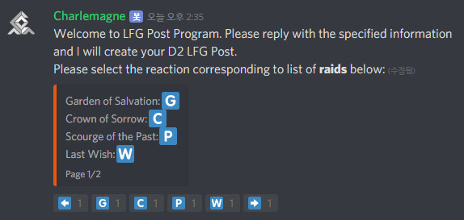

# 샤를마뉴의 LFG 기능 알아보기
샤를마뉴의 핵심 기능 중 하나인 LFG(Looking For Group)이다. 이를 통해서 각종 활동에 필요한 사람들을 효율적으로 모을 수 있다. 또한 샤를마뉴가 활동 시작 10분 전에 DM(Direct Message)로 알림을 보내주므로 이를 활용할 이유가 더욱 늘었다고 할 수 있다.
자세한 활용법은 [공식 설명서](https://warmind.io/cmds)의 LFG 탭을 참고하길 바란다.

## LFG 종류
LFG로 만들 수 있는 활동은 다음과 같다.

* 레이드
* 시련의 장
* 갬빗
* 시즌 활동 (벡스 공격작전, 악몽 사냥, 결단, 대장간 등)
* 기타 등등

안타깝게도 디스코드 봇의 한계로 인해 샤를마뉴의 활동 목록들은 영어로 제공된다. 따라서 우리는 샤를마뉴를 이용하는데에 있어 영어 표기명도 알아두어야 할 필요가 있다. 단/복수형의 차이는 생략하고 단수형으로 적도록 하겠다.  

각종 활동 영어명

* 갬빗: Gambit
* 결단: The Reckoning
* 공격전: Strike
* 눈먼 우물: Blind Well
* 대장간: Forge
* 레이드: Raid
* 벡스 공격작전: Vex Offensive
* 스토리: Story
* 시련의 장: Crucible
* 악몽 사냥: Nightmare Hunt
* 전시장: Menagerie
* 퀘스트: Quest
* 파밍: Farming
* 확대 프로토콜: Escalation Protocol
* 황혼전: Nightfall

추가로, 레이드의 경우 각 레이드의 영어명도 필요하다.

각종 레이드 영어명

* 구원의 정원: Garden of Salvation
* 슬픔의 왕관: Crown of Sorrow
* 과거의 고통: Scourge of the Past
* 마지막 소원: Last Wish
* 리바이어던: Leviathan
* 리바이어던 - 행성 포식자: Leviathan - Eater of Worlds
* 리바이어던 - 별의 탑: Leviathan - Spire of Stars

## LFG 생성하기
본인이 어떤 활동을 하고 싶은데 사람이 필요하다면 LFG를 만들면 된다. 관심 있는 사람들이라면 참가를 해줄 것이다.  
`#봇게시판`에 `!lfg create`를 입력한다. 샤를마뉴가 다음과 같은 응답을 할 것이다.

본인이 원하는 활동을 선택하고 나면 활동 시작 시간을 선택해야 한다.

레이드 시작 시간을 정해야 한다. 기본적으로 KST(Korea Standard Time, 한국 표준시)가 디폴트로 설정되어 있으므로 양식에 맞게 날짜와 시간을 입력해준다. 만약 지금 당장 시작할 예정이라면 `now`를 입력한다.  
예) `11:00 pm kst 12/25` - 12월 25일 오후 11시 정각에 시작

그 다음으로는 활동에 대한 설명을 요구한다. `none`이라고 적으면 별다른 설명을 추가하지 않지만, 적어도 너가 어떤 활동을 할 것이고 어떤 식으로 할 것인지 등 뭔가 LFG를 보는 사람들에게 두번 말 안해도 되게 설명을 적어두는 것을 권장한다.

이렇게 하면 LFG가 생성된다. `join id`를 잘 기억해두는 것이 좋다. 왜냐면 나중에 `#잡담`등의 다른 채널에서 LFG를 보여주고 싶을때 `!lfg [join id]`를 입력하면 해당 LFG를 바로 보여주기 때문이다.

## LFG 이용시 주의할 사항
### LFG는 약속이다
LFG를 기존의 '레이드 모집'과 비슷하게 생각해서는 곤란하다. LFG 생성시 레이드 시작 시간을 정하게 되어 있는데, 이는 약속이다. 본인이 정해진 시간에 도착하겠다 라는 약속이다.  
만약 본인이 해당 시간에 도착할 수 있을지 잘 모르겠다면 `+` 버튼보다는 `?` 버튼을 눌러 '참여할 수도 있고 아닐 수도 있다'라는 의사를 표시하는 것이 좋다.