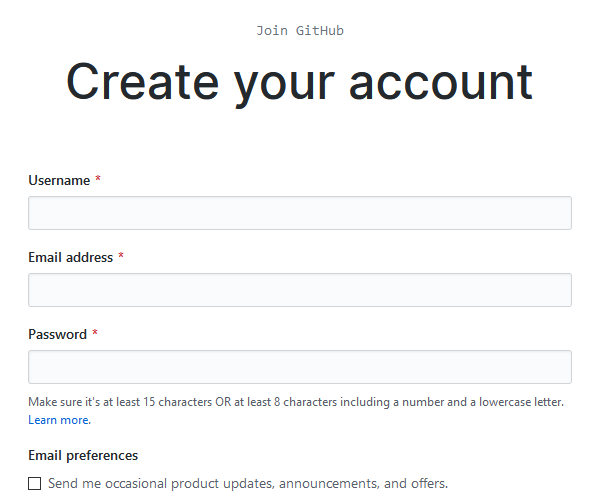
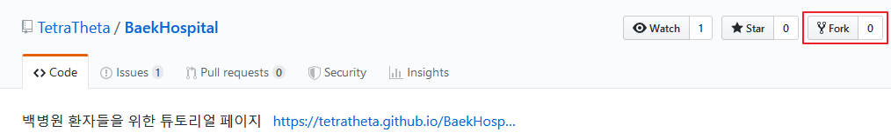

# 기여하기
이 사이트의 내용을 혼자서 채워넣는 것은 상당히 힘든 일이다. 튜토리얼이 일부만 보여주어서야는 튜토리얼이라고 하기 힘들지 않겠는가.  
따라서 클랜원들의 자발적인 기여는 정말로 큰 도움이 된다.
  
[GitHub](https://github.com/join)에 가입한 후, GitHub에 가입할 때 사용했던 이메일과 닉네임을 디스코드 서버에서 `@TetraTheta`를 호출해 사이트에 기여하고 싶다고 하면 관련 권한 등을 처리해줄 것임.
  
'이러이러한 것에 대해 설명해주었으면 좋겠다'라고 생각한다면 [이슈 트래커](https://github.com/TetraTheta/BaekHospital/issues)에 글을 등록하고, 만약 그것에 대해 설명할 수 있다면 이 저장소(Repository)를 포크한 다음 너가 항목을 새로 만들어넣고 그걸 머지 리퀘스트에 올리면 된다.  
이해하기 어렵다면 구글링을 조금 해봐. 많은 도움이 될 거다.
  
이 사이트는 [docsify](https://docsify.js.org)를 이용해서 작성되었으므로, 뭔가 글에 이쁜걸 넣고 싶다면 여길 참고해서 넣으면 된다.

## 정말로 기여해보기
이 글만 보고 따라하기보다는 직접 구글에 'git'이라고 검색해서 나오는 가이드 글을 보는 것을 더 추천한다. 내 설명솜씨가 그닥 좋지 않기 때문이기도 하고, 다른 사람들이 나보다 더 잘 알기 때문이기도 하다.
### 저장소 포크하기
먼저 GitHub 계정을 만들어야 한다. [GitHub](https://github.com/join)에서 가입을 진행한다.

Username은 누구인지 알아볼 수 있게 정하는게 나중에 도움이 되니, 아무렇게 만들지 않도록 하는게 좋다.  
Email preferences의 체크박스는 굳이 체크 안해도 된다.  
그 다음 [이 페이지의 Repository](https://github.com/TetraTheta/BaekHospital)에 들어가서 붉은색으로 표시된 버튼을 누른다.

이렇게 하면 너의 계정에도 `BaekHospital`이라는 저장소가 생겼을 것이다.

### 내 컴퓨터에서 작업하기
이제 너의 컴퓨터에서 작업을 시작할 수 있다. GitHub 웹페이지에서도 제한적으로 작업이 가능하지만, 나는 컴퓨터에서 작업하는 것을 추천한다.
  
먼저 적당한 에디터 프로그램을 설치한다. [Notepad++](http://notepad-plus-plus.org/downloads/)도 괜찮고 [Visual Studio Code](https://code.visualstudio.com/Download)도 괜찮다. 메모장을 사용할 수는 있지만, 인코딩 등 약간 까다로운 점이 있어서 그닥 추천하지는 않는다. 그 이외에도 너가 선호하는 편집기가 있다면 그걸 써도 좋다. Notepad++는 한국어 언어팩을 선택해서 설치할 수 있고, Visual Studio Code는 한국어 언어팩을 추가로 다운로드 할 수 있다. 자세한 방법은 구글신을 이용해보도록 하자. 구글신은 모든 것을 알고 계신다.
  
Git 역시 설치해주어야 한다. [Git](https://git-scm.com/download)을 다운로드 받고 실행하면 이것저것 묻는데, 영어 잘 해석해서 설치하면 된다. 잘 모르겠다면 역시나 우리를 굽어살펴주시는 구글신에게 의지해보자.
  
이제 작업할 준비가 되었다. 너의 작업폴더가 될 폴더를 하나 만들자. 귀찮으니까 대충 `C:\Development\BaekHospital`에서 작업하는 것을 예시로 들거다.  
명령 프롬프트를 연다. <kbd>Win</kbd> + <kbd>R</kbd>을 누른 후, `cmd`를 입력한다.
```batch
mkdir C:\Development
cd C:\Development
git clone https://github.com/[YOUR-USERNAME-HERE]/BaekHospital.git
```
`[YOUR-USERNAME-HERE]`는 너가 적당히 너 Username으로 바꾸면 된다. 이렇게 하면 `C:\Development\BaekHospital` 경로 안에 이런저런 파일들이 보일거다. 이제 너가 하고 싶은대로 만져보면서 새로운 문서도 추가해보고, 레이아웃도 약간 바꿔보고 하면서 연습해봐라.

#### 커밋하기
뭔가 바꿨으면 이제 커밋이란걸 해야한다. 나는 가능한 한 작은 변경사항 위주로 커밋하는 것을 권장하는데, 한번에 이것저것 다 바꾸고 커밋한 다음 나중에 머지 리퀘스트를 보냈을 때 거절당하면 무엇 때문에 거절당했는지 알기 힘들다. 따라서 어떠한 문서를 만들어 그 내용을 채워넣었다면 커밋하고 다른 문서를 편집한다거나 하는 식으로 커밋을 자주 하는 것이 나중에 좋다.  
커밋에 대해 이것저것 써놨는데 어떻게 하는지 모를것이다.
```batch
cd C:\Development\BaekHospital
git add .
git commit -m "커밋에 대한 설명 입력"
```
이런 방식으로 커밋을 하면 된다. 아까 말했듯이, 커밋을 할 때에는 최소한의 단위로 수정을 하고 커밋을 하는 식으로 작업하는 것이 나중에 머지 리퀘스트가 거절당했을 시 이유를 파악하는데 도움이 된다.

#### 푸시하기
커밋을 한다고 그게 너의 GitHub 저장소에 바로 반영되는 것은 아니다. 너의 컴퓨터에서 작업한 것을 GitHub 서버에 올려주어야 한다. 이걸 푸시(Push)라고 부른다. 반대로 서버에 있는 작업물을 너의 컴퓨터로 내려받는걸 풀(Pull)이라고 부르고.  
작업물을 GitHub 서버에 올리려면 역시나 명령어를 이용하면 된다.
```batch
cd C:\Development\BaekHospital
git push origin master
```
만약 '`origin`이 뭔지 모르겠어요 빼애액'같은 메세지가 나온다면 원격 저장소를 추가해줘야 한다. 그런데 내가 해보니까 기본적으로 `git clone`을 제대로 했으면 이런 문제가 일어나지 않을거다. 별 수 있나. 수정해야지.
```batch
git remote add origin https://github.com/[YOUR-USERNAME-HERE]/BaekHospital.git
```
이렇게 한 후 다시 `git push origin master`를 해보자.

### 머지 리퀘스트 하기
일단 이건 나도 해본 적이 없어서 조금의 연구가 필요하다. 당장 급한 사람은 구글신에게 물어보도록. 나도 연구를 조금 더 해본 후 적도록 하겠다.