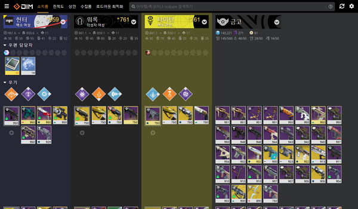

# 유용한 정보
이 사이트 이름이 '백병원 튜토리얼'이긴 하지만, 그렇다고 기초적인 정보만 알려줄 생각은 없다. 현재 디스코드 `#공략게시판`에 유용한 정보들이 가득 있긴 하지만 디스코드 채널 특성상 이를 한눈에 보기란 매우 어렵다. 따라서 데스티니 마이너 갤러리와 `#공략게시판`, 기타 해외 사이트 등에서 모은 유용한 정보들을 이 카테고리 밑에서 안내할 생각이다.

## 유용한 사이트 목록
데스티니를 하면서 참고하면 좋을만한 사이트들을 모아보았다. 좋은 사냥 되기를.

1. [DIM(Destiny Item Manager)](https://app.destinyitemmanager.com)  
'딤'이라고 부르거나 철자 그대로 '디-아이-엠'이라고 읽는다. 데스티니 모바일 공식 앱으로도 DIM처럼 아이템을 관리할 수 있지만, DIM은 단순히 인벤토리 관리 기능뿐만 아니라 퀘스트 진척도, 경이 아이템 수집 현황 등 다양한 기능을 제공하고 있다. 그렇다고 인벤토리 관리 기능이 부족한 것도 아니니, 자주 이용해보자.  
모바일에서는 [Little Light](https://play.google.com/store/apps/details?id=me.markezine.luzinha)같은 앱으로 인벤토리를 관리할 수 있다.

2. [Niris.tv](https://www.niris.tv/blog/)  
영어로 된 사이트이긴 하다만, 갤러리에서 인포그래픽으로 어떤 정보가 올라왔다면 대다수가 이 사이트의 이미지를 번역한 것이다. 매 주 바뀌는 정보들에 대해서 꼬박꼬박 인포그래픽을 만들어 올리는 사람이다. 다만 인포그래픽으로 만들어서 올리는만큼, 업데이트 속도는 약간 느린 편이니 주간 리셋 직후에 방문하는 것은 권장하지 않는다.  
현재 이미지 서버에 뭔가 문제가 있는지, 이미지가 로딩이 되지 않고 있지만 아마 금방 해결될 것으로 보인다.

  * [쥴(Xûr)의 판매목록 및 스탯](https://www.niris.tv/blog/xurs-wares)  
    쥴이 파는 아이템과 그 스탯을 보여준다.
  * [주간 리셋](https://www.niris.tv/blog/weekly-reset)  
    주간 리셋에 따라 바뀌는 다양한 활동들에 대한 정보를 담고 있다.
  * [공개 이벤트 영웅 이벤트로 바꾸는 법](https://www.niris.tv/blog/hpe)  
    오픈 필드에서 발생하는 공개 이벤트들은 각자 특정한 조건을 만족하면 영웅 이벤트로 바뀌는데, 어떻게 하면 되는지에 대한 설명을 담고 있다.  

이외에도 다양한 정보와 팁이 담겨있으니, 영어를 어느정도 해석할 줄 안다면 방문해보는 것을 추천한다.
3. [destiny2-project](https://d2-info.web.app/)  
위의 Niris.tv가 영어로 된 정보를 제공했다면, 이 사이트는 한국어로 된 정보를 제공한다. 물론 사이트가 다른 만큼 같은 정보를 제공하는 것은 아니다. 하지만 한국어로 된 만큼 이해하기 더 쉬울 것으로 예상된다.

  * [개시시간 공략](https://d2-info.web.app/zeroHour)  
    개시시간을 영웅으로 돌면 주차별로 소각로의 길이 바뀐다. 게다가 촉매제 추가 진척도를 위해 퍼즐을 풀 수도 있다. 이때 이 사이트를 참조하면 훨씬 쉽게 진행할 수 있을 것이다.
  * [황혼전 속성 및 고유보상](https://d2-info.web.app/nightfall)  
    황혼전은 아프다. 특히나 점수를 위해 전투력 제한을 많이 걸어놓았다면 더욱. 게다가 각 황혼전에서 주로 나오는 속성도 알아두어야 할 필요가 있다. 독점 보상이 무엇인지도 알아야 그걸 파밍할 수 있다.
  * [각 레이드 공략 이미지](https://d2-info.web.app/raid)  
    여기에서 레이드에 대한 완벽한 공략을 알려주는 것은 아니다. 완벽한 공략이 필요하다면 YouTube를 뒤져보는 것이 더 도움이 될것이다. 하지만 중간중간 나오는 기믹이나 미로 등에 대해서는 이 사이트에서 보여주는 이미지를 참고하는 것이 매우 유용하다.
  * [풍요의 성배 룬 조합법 및 주차별 속성](https://d2-info.web.app/chaliceOfOpulence)  
    '성배 룬 어떻게 조합해야 뭐가 나오나요?'라는 질문을 해본 적이 있다면 이 사이트가 적격이다. 룬을 어떻게 조합해야 무엇이 나오는지 알 수 있다. 또한 발화 속성 정보와 기타 속성 정보또한 나와있다.
  * [승천 정보 및 공략](https://d2-info.web.app/ascension)  
    지금은 아니다만, 예전에는 주간 승천 도전을 완료하면 강력한 장비를 주곤 했다. 물론 지금도 승천 도전이 필요할 수도 있다. 여기에서는 각 주차별 승천 도전 포탈의 위치 및 승천 도전 공략을 YouTube 영상으로 안내한다.
  * [일일 영웅 이야기](https://d2-info.web.app/dailyHeroic)  
    일일 영웅 이야기의 위치와 시간에 대한 정보를 담고 있다.

이외에도 몇가지 유용한 정보가 더 있으니, 편안한 마음으로 찾아보길 권장한다.