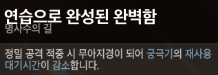
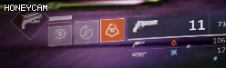
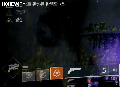
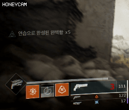
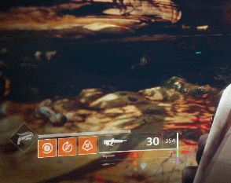

## 쏙독새와 명사수의 길

데스티니를 시작하면서 훈타를 플레이하면 꼭 먹고싶은 경이 중 하나

쏙독새의 설명과 사용방법, 그에 따른 플레이 스타일에 대해 적은 글이다.

## 설명

쏙독새는 헌터의 총잡이 궁극기를 1발로 줄이는 대신 데미지를 높히고 처치시 궁극기를 33퍼 되돌려주는 경이다.

만약 이 경이를 사용할 경우 헌터의 윗트리 무법자의 길[6연발]과 밑트리 명사수의 길[3발] 중 명사수의 길을 고르는걸 추천한다

흔히 명사수의 길을 쏙독새 사용시 고르는 궁극기 트리라고 생각하면 된다

궁극기로 정밀 피해를 줄 수 있기에 약점공격을 하면 데미지를 매우 많이 뽑아낼 수 있다.

하지만 모든 보스가 무조건 한방에 죽는다는 생각은 하지않는게 좋다. 이 게임은 던파나 메이플이 아니다.

짧은 시간 데미지를 뽑아내고 다른 무기로 딜을 하므로써 dps [초당 피해량]을 높히는 것에 의미를 두면 된다.

## 명사수의 길

|쏙독새를 사용사는 사람들은 평소부터 정밀 피해를 노리면서 플레이 하는 것이 좋다|
|:----------|
||

이 사진의 스킬은 명사수의 길 패시브라고 생각하면 되는데, 정밀 공격 적중 시 궁극기 쿨타임이 감소한다.

| **평상시 궁 게이지 차는 속도** | **5스택시 차는 속도** |
|:----------:|:-------------:|
|  |  |

정확히 이 스킬에 대해 적자면 정밀 타격수에 따라 버프가 5회까지 누적된다

그리고 사진을 보면 버프 누적 상태에 따라 궁극기 쿨타임이 매우 빨리 줄어드는 것을 알 수 있다.

이 뿐만이 아니라

| **5스택 3킬** | **2버프킬 2마리, 1버프킬 2마리** |
|:----------:|:-------------:|
|  |  |

버프 누적 상태에서 적을 죽이면 궁게이지 반환이 매우 많이 차는 것을 볼수 있다

쉽게 버프 누적 상태가 높을 수록, 오래 유지할수록, 더 많이 죽일수록  쿨타임 감소가 진행한다.

## 근접 능력

헌터에서 많이 언급되지 않는 근접 능력이다

적과 일정 거리를 두고 사용하지 않으면 근접공격과 같은 버튼이기 때문에

능력 발동보다 근접 공격이 나가는 불상사로 특성 컨샙을 잡는 세팅이 아니면 많이 언급되지 않는다

명사수의 길에서 근접능력인 칼춤꾼은 칼을 한자루 던지는데

정밀처치를 할 경우 근접능력이 재충전된다. 

물론 초보자들이 바쁜와중에 칼로 정밀처치까지 하라는 말은 아니다

그런건 익숙해지면 알아서 하게되고

핵심은 이 근접능력으로 적을 죽이게 되면 총 궁극기 쿨타임의 약 1/16정도 줄게 된다

별로 안줄은거 같지만 cm로 말하면 궁극기 바에서 약 1.4cm

**4칸으로 이루어진 궁극기 바에서 1칸의 1/4를 채우는 꽤 쏠쏠한 능력이다.**

솔라 쉴드를 제거할때 사용해도 좋지만 아쉽게도 어떤 경우에도 적이 죽지않으면 궁극기 게이지는 차지않는다

그렇다고 무조건 킬만 노리지는 것보다 융통성 있게 사용하길 바란다.

## 쏙독새 플레이 스타일

공격전 매칭해보면 대부분의 초보 플레이어들이 특수탄과 중화기탄, 그리고 궁극기를 매우 아끼다가 보스한테 몰아쓰는 경향이 있다 

최소한 이걸 보는 사람들은 그러지 않았으면 한다.

위 사진을 보면 알듯이 몇 마리 처치하면 벌써 궁극기 쿨타임이 돈다.

게다가 방어구에 몇몇 개조부품을 소지하고 있으면 매번 궁극기가 차있다고 생각하면 된다.

하지만 아쉽게도 보스에게 박는 그 뽕맛만 생각하며 궁극기를 쓰지않고 묵혀두는 플레이어가 매우 많다

딱봐도 피통이 커보인다, 처리하기 귀찮아보인다, 노란색 피통이다 싶으면

**바로 그냥 궁 박아주는걸 추천한다.**

어짜피 몇마리 잡으면 금방 찬다. 

쏙독새의 올바른 플레이는 빠른 궁극기 회전을 통한, 원할한 플레이 진행과 한정된 보스 딜타임에 높은 dps를 이용한 딜이 주 핵심이다. 

**그리고 기본적으로 약점 타격을 생각하며 싸우는 것이 좋다.**

보통 공방에서 매칭잡아 공격전을 돌려보면 130킬에 정밀피해 20~30나오는 사람이 허다하다

하지만 최소한 이 팁을 본사람이라면 정밀피해를 준다는 생각으로 플레이하면 좋다

그렇게 생각하고 플레이만 해도 킬수는 비슷하고 정밀피해가 50~60킬 등 반타작은 정밀피해가 될 것이다.

많은 초보들이 이 경이를 먹고 재밌는 플레이를 하길 바란다. 
 

